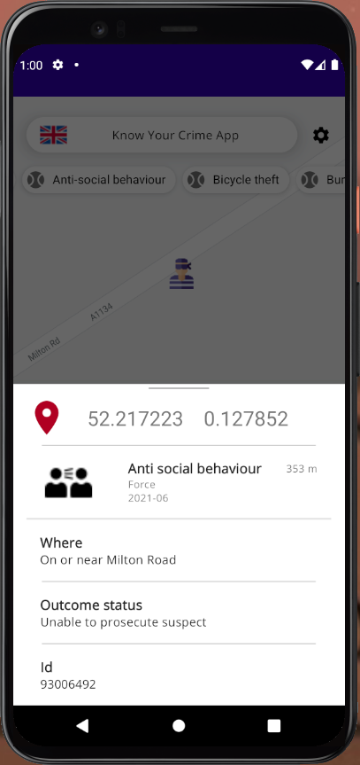

# KnowYourCrime

## about
KnowYourCrime is a crime map fetching data from UK Police API.
```
https://data.police.uk/docs/
```

## setting up
```
You need your own google maps API_KEY to set project up
Put this line in local.properties
MAPS_API_KEY=Your api key
```

## technologies used
```
kotlin
android
mvvm
livedata
retrofit
gson
koin
coroutines
jetpack navigation component
google maps
```

## screenshots





